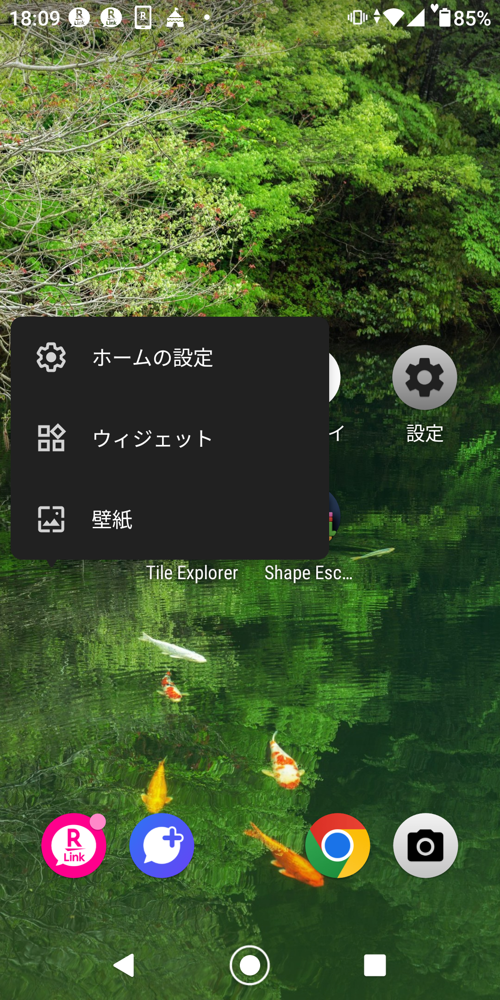
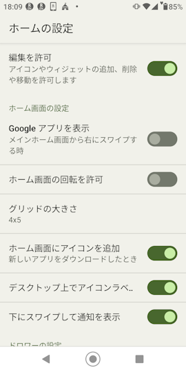
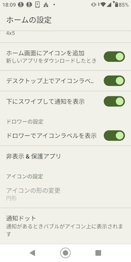

## Standalone Android Launcher 

Build by Androd Studio Dolphin (2021.3.1 Canary 9)
  
### Modding Note  
1. Renamed launcher3 class to launcher3b  
2. Hide app icons without labels in the drawer  
3. Disable changing icon style in settings (because it doesn't work)
  
### Install Notes
1.Release ビルド版だとインストールを受け付けない。GooglePlayが邪魔している? 
  
  
### Screenshots

